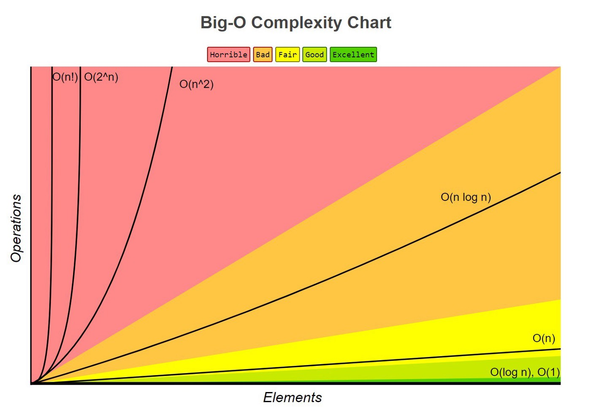

### 集合环绕取值公式
环绕指的是当索引数(下标)大于列表大小时, 绕回到0接着往后找(通过求余可以减少边界值判断).     
> index % list.size()

&nbsp;  
&nbsp;  

### 常见的时间复杂度
   

&nbsp;   

| 符号 | 英文名 | 中文名 |
|---|:---:|:---:|
| O(1) | Constant Time  | [常量阶](time_complexity/O1.md) |
| O(logn) | Logarithmic Time | [对数阶](time_complexity/Ologn.md) |
| O(n) | Linear Time | [线性阶](time_complexity/On.md) |
| O(nlogn) | Quasilinear Time | [线性对数阶](time_complexity/Onlogn.md) |
| O(n^2) | Quadratic Time | [平方阶](time_complexity/On^2.md) |
| O(n^3) | Cubic Time | [立方阶](time_complexity/On^3.md) |
| O(2^n) | Exponential Time | [指数阶](time_complexity/O2^n.md) |
| O(n!) |Factorial Time | [阶乘阶](time_complexity/On!.md) |

&nbsp;  
&nbsp;  
### 排序  
1. [冒泡排序(Bubble Sort)](sorts/ComparisonSorting/bubble_sort.py)  
2. [选择排序(Selection Sort)](sorts/ComparisonSorting/selection_sort.py)  
3. [插入排序(Insertion Sort)](sorts/ComparisonSorting/insertion_sort.py)  
4. [希尔排序(Shell Sort)](sorts/ComparisonSorting/shell_sort.py)  
5. [快速排序(Quick Sort Recursion Version)](sorts/ComparisonSorting/quick_sort_recursion.py)  
6. [快速排序(Quick Sort Partition Version)](sorts/ComparisonSorting/quick_sort_partition.py)  
7. [归并排序(Merge Sort)](sorts/ComparisonSorting/merge_sort.py)  
8. [桶排序(Bucket Sort)](sorts/bucket_sort.py)  
9. [堆排序(Heap Sort)](sorts/heap_sort.py)  
10. [计数排序(Count Sort Simple Version)](sorts/count_sort_simple.py)
10. [计数排序(Count Sort Complex Version)](sorts/count_sort_complex.py)
10. [基数排序(Radix Sort)](sorts/radix_sort.py)

&nbsp;  
&nbsp;
### 搜索

&nbsp;  
&nbsp;  
### 数据结构  

&nbsp;  
&nbsp;   
### 学习资源
[C语言中文网](http://c.biancheng.net/data_structure/)   
[数据结构、算法与应用](https://book.douban.com/subject/26421141/)   
[极客时间-王争-数据结构与算法之美](https://time.geekbang.org/column/126)   
[LeetCode101题精讲](./LeetCode101-A-LeetCode-Grinding-Guide-(CPP-Version).pdf)   
[Understanding time complexity with Python examples](https://towardsdatascience.com/understanding-time-complexity-with-python-examples-2bda6e8158a7)  
[usfca algorithms](https://www.cs.usfca.edu/~galles/visualization/Algorithms.html)  
[visualgo](https://visualgo.net/en)  
