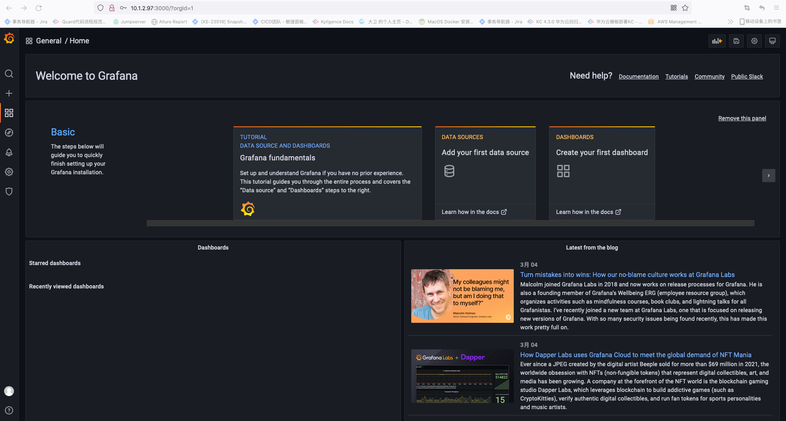

### 版本
Enterprise: 企业版  
OSS(Open Source Software): 开源版

### 安装
[参考资料-1](https://grafana.com/grafana/download) 
```shell
wget https://dl.grafana.com/enterprise/release/grafana-enterprise-8.4.3-1.x86_64.rpm
sudo yum install grafana-enterprise-8.4.3-1.x86_64.rpm
```

### 安装插件
[参考资料-1](https://cloud.tencent.com/developer/article/1682394)
```shell
# grafana下载boom theme插件
grafana-cli plugins install yesoreyeram-boomtheme-panel
# 世界ping
grafana-cli plugins install raintank-worldping-app
# 世界地图面板
grafana-cli plugins install grafana-worldmap-panel
# 轻松地增强对网络流量的可见性
grafana-cli plugins install kentik-app
# NS1 Grafana应用程序可让您实时查看DNS流量并监视NS1平台内配置的作业
grafana-cli plugins install ns1-app
# 时钟
grafana-cli plugins install grafana-clock-panel
# 饼图
grafana-cli plugins install grafana-piechart-panel
grafana-cli plugins install macropower-analytics-panel
grafana-cli plugins install digiapulssi-breadcrumb-panel
grafana-cli plugins install andig-darksky-datasource
grafana-cli plugins install citilogics-geoloop-panel
grafana-cli plugins install bessler-pictureit-panel
grafana-cli plugins install natel-plotly-panel
grafana-cli plugins install snuids-radar-panel
grafana-cli plugins install blackmirror1-statusbygroup-panel
grafana-cli plugins install snuids-trafficlights-panel
grafana-cli plugins install smartmakers-trafficlight-panel
grafana-cli plugins install btplc-trend-box-panel
grafana-cli plugins install fatcloud-windrose-panel
# 气泡图
grafana-cli plugins install digrich-bubblechart-panel
# json数据
grafana-cli plugins install grafana-simple-json-datasource
# k8s监控应用
grafana-cli plugins install grafana-kubernetes-app
# WindRoseby 极坐标图
grafana-cli plugins install fatcloud-windrose-panel
# 雷达图
grafana-cli plugins install snuids-radar-panel
# 世界地图热力图
grafana-cli plugins install ovh-warp10-datasource
# 选点监控
grafana-cli plugins install natel-usgs-datasource
# es数据监控
grafana-cli plugins install stagemonitor-elasticsearch-app
# Plotly直接坐标系散点图
grafana-cli plugins install natel-plotly-panel
# 组织结构图
grafana-cli plugins install digiapulssi-organisations-panel
# ajax请求更新数据
grafana-cli plugins install ryantxu-ajax-panel
```

### 启动
[参考资料-2](https://www.cnblogs.com/xiao987334176/p/11944558.html)  

默认监听端口: 3000  
默认配置文件: /etc/grafana/grafana.ini

```shell
systemctl enable grafana-server       # 开机自启动grafana服务
systemctl start grafana-server        # 启动grafana服务
```


### 访问

默认账号: admin
默认密码: admin

