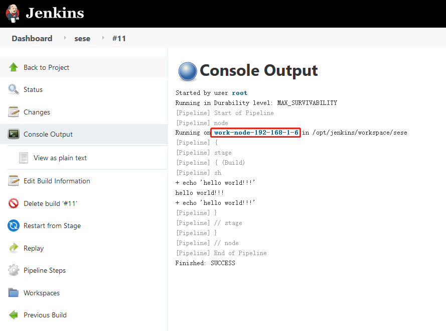
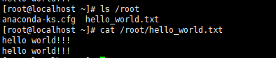

### 在指定节点上构建任务

在 `pipeline` 的 `DSL` 语法中, 通过 [`agent`](https://www.jenkins.io/doc/book/pipeline/syntax/#agent-parameters) 可以在指定节点上构建任务.     
其中, "work-node-192-168-1-6" 是在创建节点时声明的[label](./new_node.md).

```shell
pipeline {
    agent {
        label "work-node-192-168-1-6"
    }
    
    stages {
        stage('Build') {
            steps {
                sh """echo 'hello world!!!'; 
                      echo 'hello world!!!' >> /root/hello_world.txt;
                   """
            }
        }
    }
}
```

执行结果如下
- jenkins console output  
   
   
- linux console output  
   