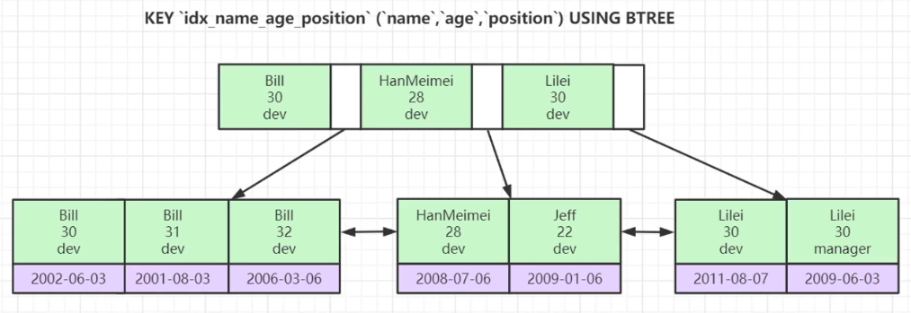

### 索引最左前缀匹配原则
一般情况下当我们说建一个索引, 对于`MySQL`的`InnoDB`来说就是创建一颗`B+树`.   
一个包含多字段的联合索引, 例如: (`name`, `age`, `position`) 三个字段组成的联合索引;   
对应于`MySQL`的`InnoDB`来说, 就是创建一颗`B+树`(辅助索引), Key保存的是三个字段的值, Value是指向聚集索引的Key.   

在`B+树`中, 三个字段组成的Key是严格按照定义联合索引时, 指定的字段顺序来生成的.  
联合索引的插入维护成本是比较高的, 不像自增主键那样总是往后插入数据, 而是根据插入时实时的排序和插入, 这就有排序和分裂的开销.  

假设有七条数据, 它们分别是:   
```
数据一: name='Bill',      age=30, position='dev'       
数据二: name='Bill',      age=31, position='dev'       
数据三: name='Bill',      age=32, position='dev'    
数据四: name='HanMeimei', age=28, position='dev'  
数据五: name='Jeff',      age=22, position='dev'  
数据六: name='Lilei',     age=30, position='dev'  
数据七: name='Lilei',     age=30, position='manager'  
```
对应于`MySQL`的`InnoDB`来说, 这三条数据生成的Key长这样:


单字段查询`where name='Bill'`, 使用索引, 因为`name`字段是经过排序的, 二分查找可以有效命中.   
单字段查询`where age=31`, 不使用索引, 因为`age`字段并没有经过排序, 二分查找无法有效命中.   
两字段组合查询`where name='Bill' and age=32`, 使用索引, 
因为`name`字段经过排序, 同时因为在`name`的基础上`age`也是经过排序的, 所以二分查找可以有效命中.   
下面列出完整的匹配清单, 观察索引命中的整体规则, 为了简化排列组合, 采用 a(name), b(age), c(position) 命名.   

|组合|使用索引|描述|
|---|:---:|---|
|a|是|因为整表的`a`字段是经过排序的, 二分查找可以有效命中.|
|b|-|因为整表的`b`字段并没有经过排序, 二分查找无法有效命中.|
|c|-|因为整表的`c`字段并没有经过排序, 二分查找无法有效命中.|
|a, b|是|因为`a`字段经过排序, 同时因为在`a`的基础上`b`也是经过排序的, 所以二分查找可以有效命中.|
|a, c|-|由于`c`是基于`b`来分组排序的, 所以在`a`的基础上`c`肯定没有排序, 二分查找无法有效命中.|
|b, a|是|`MySQL`优化器会将`b`, `a`位置换成`a`, `b`然后在去查询, 因此会使用索引.|
|b, c|-|整表的`b`字段并没有经过排序, 二分查找无法有效命中, 所以后续的`c`也不会命中索引.|
|c, a|-|整表的`c`字段并没有经过排序.|
|c, b|-|整表的`c`字段并没有经过排序.|
|a,b,c|是|整表的`a`字段经过排序, 同时在`a`的基础上`b`经过排序, 同时在`b`的基础上`c`经过排序, 二分查找可以有效命中.|
|a,c,b|是|`MySQL`优化器会将其转换为a,b,c; 所以可以命中索引.|
|b,a,c|是|`MySQL`优化器会将其转换为a,b,c; 所以可以命中索引.|
|b,c,a|是|`MySQL`优化器会将其转换为a,b,c; 所以可以命中索引.|
|c,a,b|是|`MySQL`优化器会将其转换为a,b,c; 所以可以命中索引.|
|c,b,a|是|`MySQL`优化器会将其转换为a,b,c; 所以可以命中索引.|

`like` 和 `范围查询` 的情况:   

|组合|使用索引|描述|
|---|:---:|---|
|a like 'j%'|是|like 后置百分号, 由于前置字符是可以确定的, 可以采用常规比较.|
|a like '%j%'|-|like 前置百分号, 无法采用常规比较, 只能全表扫描.|
|a like '%j'|-|like 前置百分号, 无法采用常规比较, 只能全表扫描.|
|a='j' and b>2 and c='h'|使用了三分之二的索引|根据key_len观察, 可以判断出仅使用到a和b的索引, c走全表扫描.<br />**范围查询优化**<br/>当没有开启`MRR`时, 当查询到大量数据时(辅助索引), 每行数据都回表一次.   <br/>当开启`MRR`后, 当查询到大量数据时, 先将所有查询到的value排序, <br/>这个value是聚集索引的key, 然后再按照排好序的key去回表查找, 这样的好处是<br/>很多key都是邻近值, 一次性可以读取到多条数据, 减少了磁盘io读取次数.<br/>**like优化**<br/>通过开启 `index_condition_pushdown` 优化参数, <br/>这个参数可以在查找聚集索引时实时处理where过滤条件, 含 `like` . |  
