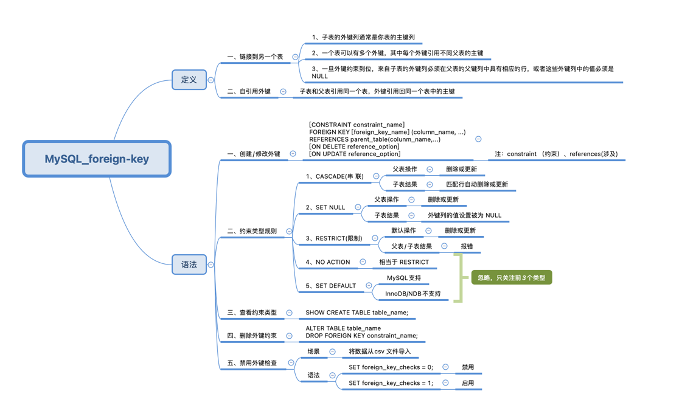

外键操作(Referential Actions)
> 参考资料:   
> [create-table-foreign-keys](https://dev.mysql.com/doc/refman/8.0/en/create-table-foreign-keys.html)   
> [mysql-on-delete-cascade](https://www.mysqltutorial.org/mysql-on-delete-cascade/)   
> [difference-between-on-delete-cascade-on-update-cascade-in-mysql](https://dba.stackexchange.com/questions/74627/difference-between-on-delete-cascade-on-update-cascade-in-mysql)

- CASCADE  
  如果在父表中[删除](tests/foreign_keys/on_delete_cascade.sql)了一行数据, 子表中对应的关联数据也会被删除.   
  如果在父表中[更新](tests/foreign_keys/on_update_cascade.sql)了一行数据的`Primary Key`字段的值, 子表中对应的关联数据也会自动更新外键值.

- RESTRICT  
  如果在父表中[删除](tests/foreign_keys/on_delete_restrict.sql)一行数据, 该行数据被子表的数据关联, 那么就会报错(可以通过上面的`CASCADE`解决这个问题).   
  如果在父表中[删除](tests/foreign_keys/on_delete_restrict.sql)一行数据, 该行数据没有被子表的数据关联, 那么就可以正常删除.   
  
  如果再父表中[更新](tests/foreign_keys/on_update_restrict.sql)一行数据的`Primary Key`字段的值, 该行数据被子表的数据关联, 那么就会报错.   
  如果再父表中[更新](tests/foreign_keys/on_update_restrict.sql)一行数据的`Primary Key`字段的值, 该行数据没有被子表的数据关联, 那么就可以正常更新.   

- NO ACTION    
  当建表时声明了 `ON DELETE NO ACTION` 或 `ON UPDATE NO ACTION` 时, `MySQL`会将它视为`RESTRICT`.  
  在 `MySQL` 中没有 `NO ACTION` 机制, 因为更新或删除数据时, 会立即触发检查.    

- SET NULL   
  如果在父表中[删除](tests/foreign_keys/on_delete_set_null.sql)一行数据, 子表中对应的外键字段的值会被更改为`Null`.

- SET DEFAULT   
  `MySQL`不支持该机制.  
  当建表时声明了 `ON DELETE SET DEFAULT` 或 `ON UPDATE SET DEFAULT` 时, `MySQL`会忽略它;     
  即: 建表语句中不包含该机制声明, 采用的时默认机制(RESTRICT).   

