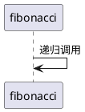

### 给自己发消息  
参与者可以给自己发信息.  

[msg2self.plantuml](plant_umls/msg2self.plantuml)


[msg2self.png](plant_umls/msg2self.png)  
<p align="center">
  
</p>


[recursion_complex.py](../algorithms/wz-course/essence/recursion_complex.py#L7)  
```python3
def fibonacci(n: int) -> int:
    if n == 0:
        return 0
    elif n == 1:
        return 1
    else:
        return fibonacci(n - 1) + fibonacci(n -2)
```

