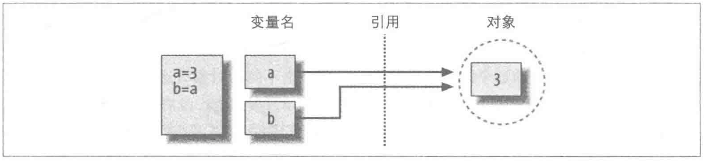

### 创建一个变量
当我们在Python中定义一个变量时, 它背后发生了什么?
```python3
a = "python"
```
1. Python 首先根据表达式推断出这是一个赋值语句, 等号左边被称为变量, 等号右侧被称为值.
2. Python 紧接着是根据右侧的值推断出它的类型是字符串.
3. Python 根据字符串的值推断出它的大小, 然后new一个内存块来保存该字符串, 并返回该内存地址(例如: 0x7f88bda2b8a0)
4. Python 创建一个变量`a`, 并将它与字符串地址进行绑定, 这个动作可以被称为赋值(普遍叫法), 也可以被称为引用(精准叫法).


结论:  
变量`a`是一个指针, 它的作用是指向到`"python"`字符串的内存空间,   
当访问变量`a`时, 就是访问指针指向的内存地址.


&nbsp;  
### 引用
指针是底层语言(C语言)的术语和概念, 指针和内存通常是由程序员自己来管理(自己创建，自己删除).    
引用是中高层语言(C++/Python/JAVA)的术语和概念, 引用的术语是为了替代指针,    
因为编程语言可以利用引用背后的技术来帮程序员管理指针和内存.   

引用采用的是计数器策略来管理内存:
1. 当引用计数器非0时, 内存空间不释放.
2. 当引用计数器为0时, 内存空间释放.

这里通过一个案例来观测它背后发生了什么.
```python3
# 衔接上面的代码: 
# a = "python"
b = a
```
1. Python 创建一个变量`b`, 并将`b`指向到`a`所指向的内存空间.
2. 此时有两个指针指向 `"python"` 这个字符串的内存空间.
3. Python 利用引用计数来维护 数据在内存中生存的依据, 目前 `"python"` 这个字符串的内存空间有两个引用.




&nbsp;  
### 解引用
解引用指的是减少对某个内存空间的引用, 通常情况下有两种做法:
1. 删除变量.
2. 用其他值来覆盖掉当前变量.
```python3
# 衔接上面的代码:
# a = "python"
# b = a
a = "C++"                   # 用其他值来覆盖掉当前变量, 最终达到解引用的目的
                            # 或者使用 del a, 也能解引用.
```
1. Python 紧接着是根据右侧的值("C++")推断出它的类型是字符串.
2. Python 根据字符串的值推断出它的大小, 然后new一个内存块来保存该字符串, 并返回该内存地址(例如: 0x7f88bda2b8a2)
3. Python 会先删除变量`a`对 `"python"` 的引用, 此时 `"python"`这个字符串的内存空间仅剩1个引用(那就是b在引用它).
4. Python 将变量`a`与字符串`"python"`地址进行绑定, 这个动作可以被称为赋值(普遍叫法), 也可以被称为引用(精准叫法).
5. 此时, `"python"`有一个引用, `"C++"`也有一个引用.


&nbsp;  
### 参考资料
[Python 存储字符串时，是如何节省空间的？](https://cloud.tencent.com/developer/article/1423754)
