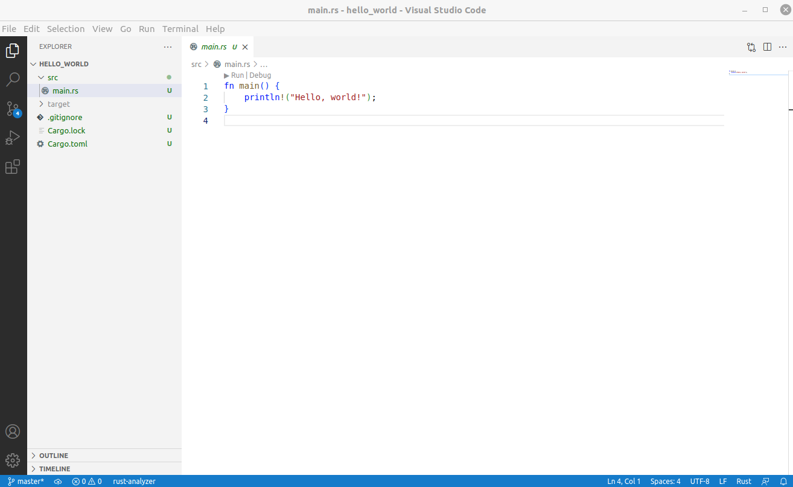

### 安装Rust

|路径|模块|
|---|---|
|${HOME}/.rustup|Rustup home directory、存放元数据、工具链|  
|${HOME}/.cargo|Cargo home directory|  
|${HOME}/.cargo/bin|cargo、 rustc、rustup、rust-gdb等等的工具命令存放目录|
|${HOME}/.bashrc|rust在这个文件中添加了一行代码: `source $HOME/.cargo/env`|
|${HOME}/Project/.vscode|基于单个项目个性化VSCode配置存放目录|


```shell
# 下载和安装Rust
$ curl --proto '=https' --tlsv1.2 -sSf https://sh.rustup.rs | sh

# 确认安装成功
$ rustc --version
rustc 1.61.0 (fe5b13d68 2022-05-18)
```

&nbsp;  
### 用VSCode打开Rust项目

1. Rust语法高亮、自动补全、文档提示, 需要安装 rust-analyzer.   
2. Rust调试, 需要安装 CodeLLDB.  

```shell
# 创建目录
$ mkdir ~/VSCodeProjects      
$ cd ~/VSCodeProjects

# 创建项目
$ cargo new hello_world

# 用VSCode打开项目
$ code ./hello_world
```
