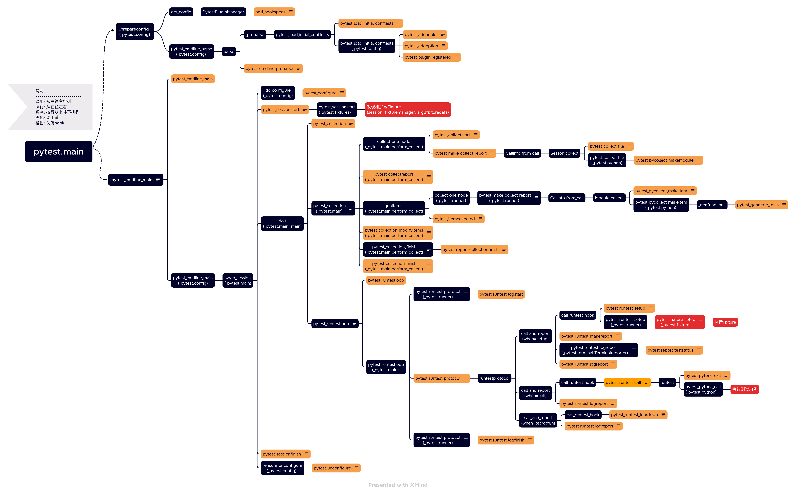

### Pytest对外暴露的Hooks清单  

|Hook|功能描述|测试用例|
|---|---|---|
|pytest_load_initial_conftests|在加载`conftest.py`和`pytest.ini`之前先执行`当前函数`.<br/>所以在`conftest.py`文件中定义`当前hook`是无效的 <br/> 只能在自定义插件(即: pip install 的插件)中定义才会被执行.<br/>**注-1:**<br/>`pytest_cmdline_preparse`不建议再使用, 而是用`当前Hook`.<br/>**注-2:**<br/>TODO: 使用场景(低频)待补充.|[自定义插件代码](./hooks/pytest-loadinitialconftests) <br/> [测试用例](./hooks/pytest-loadinitialconftests/testing)|
|pytest_cmdline_parse|此时已加载好`conftest.py`和`pytest.ini`.<br/>在解析命令行参数之前先执行`当前hook`.<br/>**注-1:**<br/>满足两个条件才会被触发: <br>1. 必须由pytest.main来驱动<br/>2. pytest.main必须指定plugins.<br/>**注-2:**<br/>我们可以在这个阶段插入额外的命令行参数.|[测试用例](./hooks/pytest-cmdlineparse)|
|pytest_cmdline_main|此时已解析好命令行参数, 生成一个`pytest.Config`对象.<br/>在处理命令行参数之前先执行 `当前hook`.<br/>**注-1:** <br/>我们可以在这个阶段根据修改`config.option`的默认值.|[测试用例](./hooks/pytest-cmdlineparse)|


&nbsp;  
### Hooks执行顺序
根据这[个测试用例](./hooks/pytest-hookorder/)可以观测hooks的执行顺序.  
```shell
pytest_load_initial_conftests
pytest_addhooks
pytest_addoption
pytest_plugin_registered: <_pytest.config.PytestPluginManager object at 0x7fdc887e7550>
pytest_plugin_registered: <_pytest.config.Config object at 0x7fdc887fed00>
pytest_plugin_registered: <module '_pytest.mark' from '/home/zt/PycharmProjects/learn_staff/venv/lib/python3.8/site-packages/_pytest/mark/__init__.py'>
pytest_plugin_registered: <module '_pytest.main' from '/home/zt/PycharmProjects/learn_staff/venv/lib/python3.8/site-packages/_pytest/main.py'>
pytest_plugin_registered: <module '_pytest.runner' from '/home/zt/PycharmProjects/learn_staff/venv/lib/python3.8/site-packages/_pytest/runner.py'>
pytest_plugin_registered: <module '_pytest.fixtures' from '/home/zt/PycharmProjects/learn_staff/venv/lib/python3.8/site-packages/_pytest/fixtures.py'>
pytest_plugin_registered: <module '_pytest.helpconfig' from '/home/zt/PycharmProjects/learn_staff/venv/lib/python3.8/site-packages/_pytest/helpconfig.py'>
pytest_plugin_registered: <module '_pytest.python' from '/home/zt/PycharmProjects/learn_staff/venv/lib/python3.8/site-packages/_pytest/python.py'>
pytest_plugin_registered: <module '_pytest.terminal' from '/home/zt/PycharmProjects/learn_staff/venv/lib/python3.8/site-packages/_pytest/terminal.py'>
pytest_plugin_registered: <module '_pytest.debugging' from '/home/zt/PycharmProjects/learn_staff/venv/lib/python3.8/site-packages/_pytest/debugging.py'>
pytest_plugin_registered: <module '_pytest.unittest' from '/home/zt/PycharmProjects/learn_staff/venv/lib/python3.8/site-packages/_pytest/unittest.py'>
pytest_plugin_registered: <module '_pytest.capture' from '/home/zt/PycharmProjects/learn_staff/venv/lib/python3.8/site-packages/_pytest/capture.py'>
pytest_plugin_registered: <module '_pytest.skipping' from '/home/zt/PycharmProjects/learn_staff/venv/lib/python3.8/site-packages/_pytest/skipping.py'>
pytest_plugin_registered: <module '_pytest.legacypath' from '/home/zt/PycharmProjects/learn_staff/venv/lib/python3.8/site-packages/_pytest/legacypath.py'>
pytest_plugin_registered: <module '_pytest.tmpdir' from '/home/zt/PycharmProjects/learn_staff/venv/lib/python3.8/site-packages/_pytest/tmpdir.py'>
pytest_plugin_registered: <module '_pytest.monkeypatch' from '/home/zt/PycharmProjects/learn_staff/venv/lib/python3.8/site-packages/_pytest/monkeypatch.py'>
pytest_plugin_registered: <module '_pytest.recwarn' from '/home/zt/PycharmProjects/learn_staff/venv/lib/python3.8/site-packages/_pytest/recwarn.py'>
pytest_plugin_registered: <module '_pytest.pastebin' from '/home/zt/PycharmProjects/learn_staff/venv/lib/python3.8/site-packages/_pytest/pastebin.py'>
pytest_plugin_registered: <module '_pytest.nose' from '/home/zt/PycharmProjects/learn_staff/venv/lib/python3.8/site-packages/_pytest/nose.py'>
pytest_plugin_registered: <module '_pytest.assertion' from '/home/zt/PycharmProjects/learn_staff/venv/lib/python3.8/site-packages/_pytest/assertion/__init__.py'>
pytest_plugin_registered: <module '_pytest.junitxml' from '/home/zt/PycharmProjects/learn_staff/venv/lib/python3.8/site-packages/_pytest/junitxml.py'>
pytest_plugin_registered: <module '_pytest.doctest' from '/home/zt/PycharmProjects/learn_staff/venv/lib/python3.8/site-packages/_pytest/doctest.py'>
pytest_plugin_registered: <module '_pytest.cacheprovider' from '/home/zt/PycharmProjects/learn_staff/venv/lib/python3.8/site-packages/_pytest/cacheprovider.py'>
pytest_plugin_registered: <module '_pytest.freeze_support' from '/home/zt/PycharmProjects/learn_staff/venv/lib/python3.8/site-packages/_pytest/freeze_support.py'>
pytest_plugin_registered: <module '_pytest.setuponly' from '/home/zt/PycharmProjects/learn_staff/venv/lib/python3.8/site-packages/_pytest/setuponly.py'>
pytest_plugin_registered: <module '_pytest.setupplan' from '/home/zt/PycharmProjects/learn_staff/venv/lib/python3.8/site-packages/_pytest/setupplan.py'>
pytest_plugin_registered: <module '_pytest.stepwise' from '/home/zt/PycharmProjects/learn_staff/venv/lib/python3.8/site-packages/_pytest/stepwise.py'>
pytest_plugin_registered: <module '_pytest.warnings' from '/home/zt/PycharmProjects/learn_staff/venv/lib/python3.8/site-packages/_pytest/warnings.py'>
pytest_plugin_registered: <module '_pytest.logging' from '/home/zt/PycharmProjects/learn_staff/venv/lib/python3.8/site-packages/_pytest/logging.py'>
pytest_plugin_registered: <module '_pytest.reports' from '/home/zt/PycharmProjects/learn_staff/venv/lib/python3.8/site-packages/_pytest/reports.py'>
pytest_plugin_registered: <module '_pytest.python_path' from '/home/zt/PycharmProjects/learn_staff/venv/lib/python3.8/site-packages/_pytest/python_path.py'>
pytest_plugin_registered: <module '_pytest.unraisableexception' from '/home/zt/PycharmProjects/learn_staff/venv/lib/python3.8/site-packages/_pytest/unraisableexception.py'>
pytest_plugin_registered: <module '_pytest.threadexception' from '/home/zt/PycharmProjects/learn_staff/venv/lib/python3.8/site-packages/_pytest/threadexception.py'>
pytest_plugin_registered: <module '_pytest.faulthandler' from '/home/zt/PycharmProjects/learn_staff/venv/lib/python3.8/site-packages/_pytest/faulthandler.py'>
pytest_plugin_registered: <module 'teamcity.pytest_plugin' from '/home/zt/Downloads/pycharm-community-2021.2.3/plugins/python-ce/helpers/pycharm/teamcity/pytest_plugin.py'>
pytest_plugin_registered: <class '__main__.Plugin'>
pytest_plugin_registered: <module 'xdist.plugin' from '/home/zt/PycharmProjects/learn_staff/venv/lib/python3.8/site-packages/xdist/plugin.py'>
pytest_plugin_registered: <module 'xdist.looponfail' from '/home/zt/PycharmProjects/learn_staff/venv/lib/python3.8/site-packages/xdist/looponfail.py'>
pytest_plugin_registered: <module 'allure_pytest.plugin' from '/home/zt/PycharmProjects/learn_staff/venv/lib/python3.8/site-packages/allure_pytest/plugin.py'>
pytest_plugin_registered: <module 'loadinitialconftests.plugin' from '/home/zt/PycharmProjects/learn_staff/venv/lib/python3.8/site-packages/loadinitialconftests/plugin.py'>
pytest_plugin_registered: <module 'cmdlineparse.plugin' from '/home/zt/PycharmProjects/learn_staff/venv/lib/python3.8/site-packages/cmdlineparse/plugin.py'>
pytest_plugin_registered: <module 'pytest_forked' from '/home/zt/PycharmProjects/learn_staff/venv/lib/python3.8/site-packages/pytest_forked/__init__.py'>
pytest_plugin_registered: <CaptureManager _method='no' _global_capturing=<MultiCapture out=None err=None in_=None _state='started' _in_suspended=False> _capture_fixture=None>
pytest_plugin_registered: <module 'conftest' from '/home/zt/PycharmProjects/learn_staff/tester/pytest/docs/hooks/pytest-hookorder/conftest.py'>
pytest_cmdline_main
pytest_plugin_registered: <Session pytest-hookorder exitstatus='<UNSET>' testsfailed=0 testscollected=0>
pytest_plugin_registered: <_pytest.cacheprovider.LFPlugin object at 0x7fdc86229130>
pytest_plugin_registered: <_pytest.cacheprovider.NFPlugin object at 0x7fdc86229100>
pytest_configure
pytest_plugin_registered: <teamcity.pytest_plugin.EchoTeamCityMessages object at 0x7fdc86229640>
pytest_plugin_registered: <class '_pytest.legacypath.LegacyTmpdirPlugin'>
pytest_plugin_registered: <_pytest.terminal.TerminalReporter object at 0x7fdc86229bb0>
pytest_plugin_registered: <_pytest.logging.LoggingPlugin object at 0x7fdc86229c10>
pytest_sessionstart
pytest_plugin_registered: <_pytest.fixtures.FixtureManager object at 0x7fdc86256dc0>
pytest_collection
pytest_collectstart
pytest_make_collect_report
pytest_collect_file
pytest_pycollect_makemodule
pytest_collectreport
pytest_collectstart
pytest_make_collect_report
pytest_pycollect_makeitem
pytest_pycollect_makeitem
pytest_pycollect_makeitem
pytest_generate_tests
pytest_itemcollected
pytest_collectreport
pytest_collection_modifyitems
pytest_report_collectionfinish
pytest_collection_finish
pytest_runtestloop
pytest_runtest_protocol
pytest_runtest_logstart
pytest_runtest_setup
pytest_runtest_makereport
pytest_report_teststatus
pytest_runtest_logreport
pytest_runtest_call
pytest_pyfunc_call
pytest_runtest_makereport
pytest_report_teststatus
pytest_runtest_logreport
pytest_runtest_teardown
pytest_runtest_makereport
pytest_report_teststatus
pytest_runtest_logreport
pytest_runtest_logfinish
pytest_sessionfinish
pytest_unconfigure

```


&nbsp;  
### Hooks调用链路图


