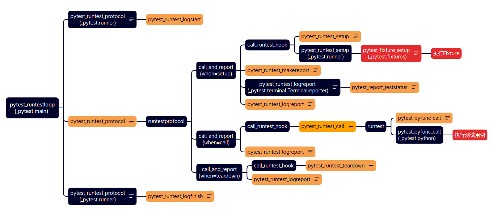
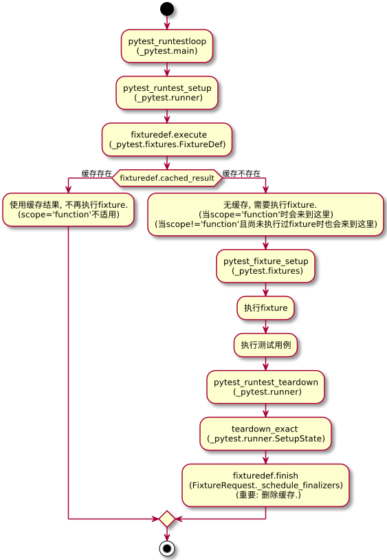

### 测试用例的执行流程
`pytest_runtestloop` 会循环地遍历每一个测试用例(`session.items`), 每个测试用例都会执行一次下图的完整流程.


&nbsp;  
### fixture作用域流程
fixture的scope有几个不同的值(`Session`、`Package`、`Module`、`Class`、`Function`),   
在执行时不同的scope值会走不同的执行流程, 下面举`scope=Function`和`scope=Module`的例子.  

  


&nbsp;  
&nbsp;  
杂记
```shell
# 当fixture(scope="function")时, 流程如下.
FixtureRequest._compute_fixture_value
FixtureRequest._schedule_finalizers(fixturedef, subrequest)
SubRequest.node._getscopeitem(self._scope)
        if isinstance(scope, str):
            ...
        if scope is Scope.Function:
            node: Optional[Union[nodes.Item, nodes.Collector]] = self._pyfuncitem
        elif scope is Scope.Package:
            ...
        else:
            ...
SubRequest.node.addfinalizer(lambda: fixturedef.finish(request=subrequest))         --> SubRequest.node == <_pytest.python.Function 具体函数名>
self.session._setupstate.addfinalizer(fin, self)
self.session._setupstate.stack[node][0].append(finalizer)


# 当fixture(scope="module")时, 流程如下.
FixtureRequest._compute_fixture_value
FixtureRequest._schedule_finalizers(fixturedef, subrequest)
SubRequest.node._getscopeitem(self._scope)
    if isinstance(scope, str):
        ...
    if scope is Scope.Function:
        ...
    elif scope is Scope.Package:
        ...
    else:
        node = get_scope_node(self._pyfuncitem, scope)
_pytest.fixtures.get_scope_node
    if scope is Scope.Function:
        ...
    elif scope is Scope.Class:
        ...
    elif scope is Scope.Module:
        return node.getparent(_pytest.python.Module)
    elif scope is Scope.Package:
        ...
    elif scope is Scope.Session:
        ...
    else:
        ...
node: <_pytest.python.Module 具体module.py>
SubRequest.node.addfinalizer(lambda: fixturedef.finish(request=subrequest))         --> SubRequest.node == <_pytest.python.Module 具体module.py>


关键部位:
1. _pytest.fixtures.FixtureRequest._schedule_finalizers
2. _pytest.fixtures.FixtureDef.finish 是不同的, 待确认.                                 function
3. _pytest.main.perform_collect
       self.genitems(node)                                                            关键部位

```
