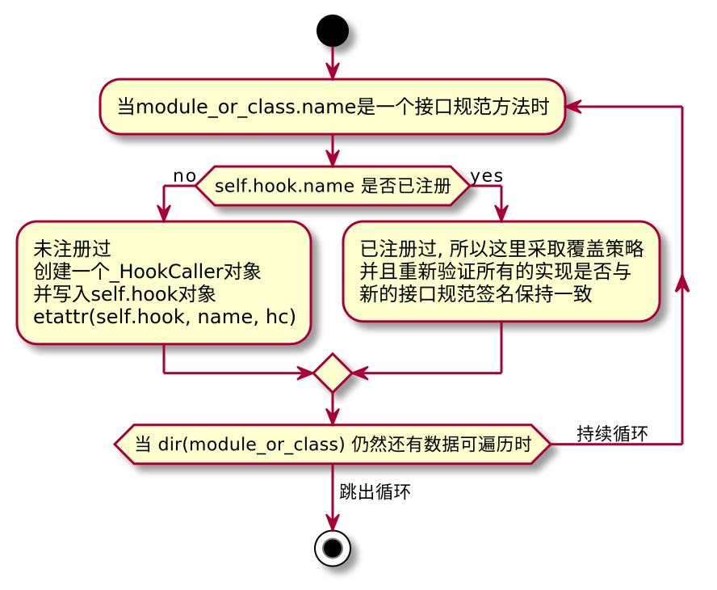

### PluginManager 类对象的介绍  

**PluginManager**是一个插件管理类, 主要的作用是 `添加接口规范`、`注册插件(增)`、`移除插件(删)`、`获取插件(查)`、`执行插件`.  

**接口规范**: *PluginManager.add_hookspecs* 将会`self.hook: _HookRelay`对象中创建具体的方法`_HookCaller`规范.  
**注册插件**: *PluginManager.register* 将所有的`实现`写入到对应的`_HookCaller.wrappers`列表中, 关系是1：N.  
**移除插件**: *PluginManager.unregister* 将所有的`实现`从`_HookCaller.wrappers`列表中移除.  
**获取插件**: *get_plugins*、*get_plugin*、*is_registered*、*has_plugin*、*parse_hookspec_opts*、*parse_hookimpl_opts*.  
**执行插件**: *PluginManager._hookexec* 执行`所有规范`下的所有`实现`.   

&nbsp;  
```python3

class PluginManager:
    """Core class which manages registration of plugin objects and 1:N hook
    calling.

    You can register new hooks by calling :meth:`add_hookspecs(module_or_class)
    <PluginManager.add_hookspecs>`.

    You can register plugin objects (which contain hook implementations) by
    calling :meth:`register(plugin) <PluginManager.register>`.

    For debugging purposes you can call :meth:`PluginManager.enable_tracing`
    which will subsequently send debug information to the trace helper.
    """

    __slots__ = (
        "project_name",
        "_name2plugin",
        "_plugin2hookcallers",
        "_plugin_distinfo",
        "trace",
        "hook",
        "_inner_hookexec",
    )

    def __init__(self, project_name: str) -> None:
        """"""  

    def _hookexec(
        self,
        hook_name: str,
        methods: Sequence[HookImpl],
        kwargs: Mapping[str, object],
        firstresult: bool,
    ) -> Union[object, List[object]]:
        """
        # called from all hookcaller instances.
        # enable_tracing will set its own wrapping function at self._inner_hookexec
        """

    def register(self, plugin: _Plugin, name: Optional[str] = None) -> Optional[str]:
        """Register a plugin and return its name.

        If a name is not specified, a name is generated using
        :func:`get_canonical_name`.

        If the name is blocked from registering, returns ``None``.

        If the plugin is already registered, raises a :class:`ValueError`.
        """

    def parse_hookimpl_opts(
        self, plugin: _Plugin, name: str
    ) -> Optional["_HookImplOpts"]:
        """"""

    def unregister(
        self, plugin: Optional[_Plugin] = None, name: Optional[str] = None
    ) -> _Plugin:
        """Unregister a plugin and all of its hook implementations.

        The plugin can be specified either by the plugin object or the plugin
        name. If both are specified, they must agree.
        """

    def set_blocked(self, name: str) -> None:
        """Block registrations of the given name, unregister if already registered."""

    def is_blocked(self, name: str) -> bool:
        """Return whether the given plugin name is blocked."""

    def add_hookspecs(self, module_or_class: _Namespace) -> None:
        """Add new hook specifications defined in the given ``module_or_class``.

        Functions are recognized as hook specifications if they have been
        decorated with a matching :class:`HookspecMarker`.
        """

    def parse_hookspec_opts(
        self, module_or_class: _Namespace, name: str
    ) -> Optional["_HookSpecOpts"]:
        """"""

    def get_plugins(self) -> Set[Any]:
        """Return a set of all registered plugin objects."""

    def is_registered(self, plugin: _Plugin) -> bool:
        """Return whether the plugin is already registered."""

    def get_canonical_name(self, plugin: _Plugin) -> str:
        """Return a canonical name for a plugin object.

        Note that a plugin may be registered under a different name
        specified by the caller of :meth:`register(plugin, name) <register>`.
        To obtain the name of n registered plugin use :meth:`get_name(plugin)
        <get_name>` instead.
        """

    def get_plugin(self, name: str) -> Optional[Any]:
        """Return the plugin registered under the given name, if any."""

    def has_plugin(self, name: str) -> bool:
        """Return whether a plugin with the given name is registered."""

    def get_name(self, plugin: _Plugin) -> Optional[str]:
        """Return the name the plugin is registered under, or ``None`` if
        is isn't."""

    def _verify_hook(self, hook: _HookCaller, hookimpl: HookImpl) -> None:
        """"""

    def check_pending(self) -> None:
        """Verify that all hooks which have not been verified against a
        hook specification are optional, otherwise raise
        :class:`PluginValidationError`."""

    def load_setuptools_entrypoints(
        self, group: str, name: Optional[str] = None
    ) -> int:
        """Load modules from querying the specified setuptools ``group``.

        :param str group: Entry point group to load plugins.
        :param str name: If given, loads only plugins with the given ``name``.
        :rtype: int
        :return: The number of plugins loaded by this call.
        """

    def list_plugin_distinfo(self) -> List[Tuple[_Plugin, DistFacade]]:
        """Return a list of (plugin, distinfo) pairs for all
        setuptools-registered plugins."""

    def list_name_plugin(self) -> List[Tuple[str, _Plugin]]:
        """Return a list of (name, plugin) pairs for all registered plugins."""

    def get_hookcallers(self, plugin: _Plugin) -> Optional[List[_HookCaller]]:
        """Get all hook callers for the specified plugin."""

    def add_hookcall_monitoring(
        self, before: _BeforeTrace, after: _AfterTrace
    ) -> Callable[[], None]:
        """Add before/after tracing functions for all hooks.

        Returns an undo function which, when called, removes the added tracers.

        ``before(hook_name, hook_impls, kwargs)`` will be called ahead
        of all hook calls and receive a hookcaller instance, a list
        of HookImpl instances and the keyword arguments for the hook call.

        ``after(outcome, hook_name, hook_impls, kwargs)`` receives the
        same arguments as ``before`` but also a :class:`_Result` object
        which represents the result of the overall hook call.
        """

    def enable_tracing(self) -> Callable[[], None]:
        """Enable tracing of hook calls.

        Returns an undo function which, when called, removes the added tracing.
        """

    def subset_hook_caller(
        self, name: str, remove_plugins: Iterable[_Plugin]
    ) -> _HookCaller:
        """Return a proxy :py:class:`._hooks._HookCaller` instance for the named
        method which manages calls to all registered plugins except the ones
        from remove_plugins."""
```


&nbsp;  
### PluginManager 类初始化
初始化过程中, 有一个必填参数`project_name` 和 `6` 个内部参数.   

**self.project_name:** 定义插件名称.  
**self._name2plugin:** `plugin_name` 映射到 `plugin实例对象` (register时提供的实例对象, 含实现方法).    
**self._plugin2hookcallers:** `plugin实例对象` 映射到 `实现集合` (register时自动发现所有的实现并纳入到这个集合中).  
**self._plugin_distinfo:** TODO: 待补充  
**self.trace:** debug堆栈调试对象, 打印调用栈相关信息.  
**self.hook:** 注册的插件规范、插件实现 都在这里.  
**self._inner_hookexec:** `pluggy`默认的`hook实现`执行器.  


&nbsp;  
### parse_hookspec_opts 方法  

从 `module_or_class.name` 这个方法中获取 `project_name + '_spec'` 属性.  
当 `project_name + '_spec'` 属性存在时, 返回一个字典对象.   
当 `project_name + '_spec'` 属性不存在时, 返回一个None.   

```python3

class PluginManager:

    def parse_hookspec_opts(
        self, module_or_class: _Namespace, name: str
    ) -> Optional["_HookSpecOpts"]:
        method: HookSpec = getattr(module_or_class, name)       # 类型注解有问题, 这里其实无法明确是什么.
        opts: Optional[_HookSpecOpts] = getattr(
            method, self.project_name + "_spec", None
        )
        return opts
```


&nbsp;  
### add_hookspecs 方法  

将接口规范写入到插件中.  

```python3

class PluginManager:

    def add_hookspecs(self, module_or_class: _Namespace) -> None:
        """Add new hook specifications defined in the given ``module_or_class``.

        Functions are recognized as hook specifications if they have been
        decorated with a matching :class:`HookspecMarker`.
        """
        names = []
        for name in dir(module_or_class):
            spec_opts = self.parse_hookspec_opts(module_or_class, name)
            if spec_opts is not None:
                hc: Optional[_HookCaller] = getattr(self.hook, name, None)
                if hc is None:
                    hc = _HookCaller(name, self._hookexec, module_or_class, spec_opts)
                    setattr(self.hook, name, hc)
                else:
                    # Plugins registered this hook without knowing the spec.
                    hc.set_specification(module_or_class, spec_opts)
                    for hookfunction in hc.get_hookimpls():
                        self._verify_hook(hc, hookfunction)
                names.append(name)

        if not names:
            raise ValueError(
                f"did not find any {self.project_name!r} hooks in {module_or_class!r}"
            )

```

用一张图来描述它的工作原理.
