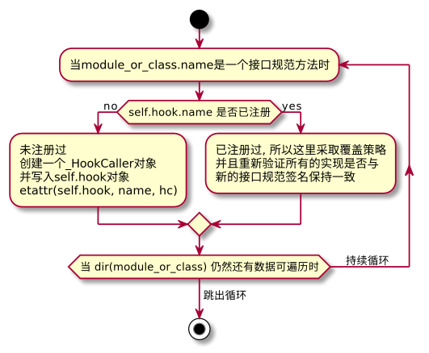
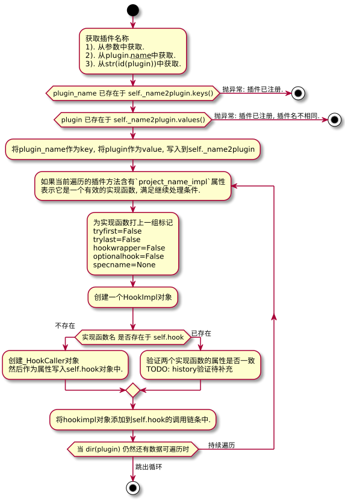

### PluginManager 类对象的介绍  

**PluginManager**是一个插件管理类, 主要的作用是 `添加接口规范`、`注册插件(增)`、`移除插件(删)`、`获取插件(查)`、`执行插件`.  

**接口规范**: *PluginManager.add_hookspecs* 将会`self.hook: _HookRelay`对象中创建具体的方法`_HookCaller`规范.  
**注册插件**: *PluginManager.register* 将所有的`实现`写入到对应的`_HookCaller.wrappers`列表中, 关系是1：N.  
**移除插件**: *PluginManager.unregister* 将所有的`实现`从`_HookCaller.wrappers`列表中移除.  
**获取插件**: *get_plugins*、*get_plugin*、*is_registered*、*has_plugin*、*parse_hookspec_opts*、*parse_hookimpl_opts*.  
**执行插件**: *PluginManager._hookexec* 执行`所有规范`下的所有`实现`.   

&nbsp;  
```python3

class PluginManager:

    __slots__ = (
        "project_name",
        "_name2plugin",
        "_plugin2hookcallers",
        "_plugin_distinfo",
        "trace",
        "hook",
        "_inner_hookexec",
    )

    def __init__(self, project_name: str) -> None:
        """"""  

    def _hookexec(
        self,
        hook_name: str,
        methods: Sequence[HookImpl],
        kwargs: Mapping[str, object],
        firstresult: bool,
    ) -> Union[object, List[object]]:
        """called from all hookcaller instances."""

    def register(self, plugin: _Plugin, name: Optional[str] = None) -> Optional[str]:
        """Register a plugin and return its name."""

    def parse_hookimpl_opts(
        self, plugin: _Plugin, name: str
    ) -> Optional["_HookImplOpts"]:
        """"""

    def unregister(
        self, plugin: Optional[_Plugin] = None, name: Optional[str] = None
    ) -> _Plugin:
        """Unregister a plugin and all of its hook implementations."""

    def set_blocked(self, name: str) -> None:
        """Block registrations of the given name, unregister if already registered."""

    def is_blocked(self, name: str) -> bool:
        """Return whether the given plugin name is blocked."""

    def add_hookspecs(self, module_or_class: _Namespace) -> None:
        """Add new hook specifications defined in the given ``module_or_class``."""

    def parse_hookspec_opts(
        self, module_or_class: _Namespace, name: str
    ) -> Optional["_HookSpecOpts"]:
        """"""

    def get_plugins(self) -> Set[Any]:
        """Return a set of all registered plugin objects."""

    def is_registered(self, plugin: _Plugin) -> bool:
        """Return whether the plugin is already registered."""

    def get_canonical_name(self, plugin: _Plugin) -> str:
        """Return a canonical name for a plugin object."""

    def get_plugin(self, name: str) -> Optional[Any]:
        """Return the plugin registered under the given name, if any."""

    def has_plugin(self, name: str) -> bool:
        """Return whether a plugin with the given name is registered."""

    def get_name(self, plugin: _Plugin) -> Optional[str]:
        """Return the name the plugin is registered under, or ``None`` if is isn't."""

    def _verify_hook(self, hook: _HookCaller, hookimpl: HookImpl) -> None:
        """"""

    def check_pending(self) -> None:
        """"""

    def load_setuptools_entrypoints(
        self, group: str, name: Optional[str] = None
    ) -> int:
        """Load modules from querying the specified setuptools ``group``."""

    def list_plugin_distinfo(self) -> List[Tuple[_Plugin, DistFacade]]:
        """Return a list of (plugin, distinfo) pairs for all setuptools-registered plugins."""

    def list_name_plugin(self) -> List[Tuple[str, _Plugin]]:
        """Return a list of (name, plugin) pairs for all registered plugins."""

    def get_hookcallers(self, plugin: _Plugin) -> Optional[List[_HookCaller]]:
        """Get all hook callers for the specified plugin."""

    def add_hookcall_monitoring(
        self, before: _BeforeTrace, after: _AfterTrace
    ) -> Callable[[], None]:
        """"""

    def enable_tracing(self) -> Callable[[], None]:
        """Enable tracing of hook calls. Returns an undo function which, when called, removes the added tracing."""

    def subset_hook_caller(
        self, name: str, remove_plugins: Iterable[_Plugin]
    ) -> _HookCaller:
        """"""
```


&nbsp;  
### PluginManager 类初始化
初始化过程中, 有一个必填参数`project_name` 和 `6` 个内部参数.   

**self.project_name:** 定义插件名称.  
**self._name2plugin:** `plugin_name` 映射到 `plugin实例对象` (register时提供的实例对象, 含实现方法).    
**self._plugin2hookcallers:** `plugin实例对象` 映射到 `实现集合` (register时自动发现所有的实现并纳入到这个集合中).  
**self._plugin_distinfo:** TODO: 待补充  
**self.trace:** debug堆栈调试对象, 打印调用栈相关信息.  
**self.hook:** 注册的插件规范、插件实现 都在这里.  
**self._inner_hookexec:** `pluggy`默认的`hook实现`执行器.  


&nbsp;  
### parse_hookspec_opts 方法  

从 `module_or_class.name` 这个方法中获取 `project_name + '_spec'` 属性.  
当 `project_name + '_spec'` 属性存在时, 返回一个字典对象.   
当 `project_name + '_spec'` 属性不存在时, 返回一个None.   

```python3

class PluginManager:

    def parse_hookspec_opts(
        self, module_or_class: _Namespace, name: str
    ) -> Optional["_HookSpecOpts"]:
        method: HookSpec = getattr(module_or_class, name)       # 类型注解有问题, 这里其实无法明确是什么.
        opts: Optional[_HookSpecOpts] = getattr(
            method, self.project_name + "_spec", None
        )
        return opts
```


&nbsp;  
### add_hookspecs 方法  

将接口规范写入到插件中.  

```python3

class PluginManager:

    def add_hookspecs(self, module_or_class: _Namespace) -> None:
        """Add new hook specifications defined in the given ``module_or_class``.

        Functions are recognized as hook specifications if they have been
        decorated with a matching :class:`HookspecMarker`.
        """
        names = []
        for name in dir(module_or_class):
            spec_opts = self.parse_hookspec_opts(module_or_class, name)
            if spec_opts is not None:
                hc: Optional[_HookCaller] = getattr(self.hook, name, None)
                if hc is None:
                    hc = _HookCaller(name, self._hookexec, module_or_class, spec_opts)
                    setattr(self.hook, name, hc)
                else:
                    # Plugins registered this hook without knowing the spec.
                    hc.set_specification(module_or_class, spec_opts)
                    for hookfunction in hc.get_hookimpls():
                        self._verify_hook(hc, hookfunction)
                names.append(name)

        if not names:
            raise ValueError(
                f"did not find any {self.project_name!r} hooks in {module_or_class!r}"
            )

```

用一张图来描述它的工作原理.   



&nbsp;  
### get_canonical_name 方法

从`plugin.__name__`获取名称, 如果没有设定, 则使用 `str(id(plugin))` 生成一个唯一编号.  

注: 一个插件可能会被使用不同的名字来注册多次, 所以当前类提供了`get_name(plugin)`和`get_plugin(name)`两种方法来获取一个插件.  

```python3

class PluginManager:

    def get_canonical_name(self, plugin: _Plugin) -> str:
        """Return a canonical name for a plugin object.

        Note that a plugin may be registered under a different name
        specified by the caller of :meth:`register(plugin, name) <register>`.
        To obtain the name of n registered plugin use :meth:`get_name(plugin)
        <get_name>` instead.
        """
        name: Optional[str] = getattr(plugin, "__name__", None)
        return name or str(id(plugin))

```


&nbsp;  
### register 方法  

注册一个插件并返回插件名称.  

由于插件采取hash键值存储结构, `plugin_name`作为`key`, `plugin对象`作为`value`,   
因此如果没有提供参数`name`, 那么就从`self.get_canonical_name`方法获取.  

如果提供的插件名已存在, 当前方法会抛出`ValueError`报错, 提示插件已注册过了.  

```python3

class PluginManager:

    def register(self, plugin: _Plugin, name: Optional[str] = None) -> Optional[str]:
        """Register a plugin and return its name.

        If a name is not specified, a name is generated using
        :func:`get_canonical_name`.

        If the name is blocked from registering, returns ``None``.

        If the plugin is already registered, raises a :class:`ValueError`.
        """
        plugin_name = name or self.get_canonical_name(plugin)

        if plugin_name in self._name2plugin:
            if self._name2plugin.get(plugin_name, -1) is None:
                return None  # blocked plugin, return None to indicate no registration
            raise ValueError(
                "Plugin name already registered: %s=%s\n%s"
                % (plugin_name, plugin, self._name2plugin)
            )

        if plugin in self._name2plugin.values():
            raise ValueError(
                "Plugin already registered under a different name: %s=%s\n%s"
                % (plugin_name, plugin, self._name2plugin)
            )

        # XXX if an error happens we should make sure no state has been
        # changed at point of return
        self._name2plugin[plugin_name] = plugin

        # register matching hook implementations of the plugin
        for name in dir(plugin):
            hookimpl_opts = self.parse_hookimpl_opts(plugin, name)
            if hookimpl_opts is not None:
                normalize_hookimpl_opts(hookimpl_opts)
                method: _HookImplFunction[object] = getattr(plugin, name)
                hookimpl = HookImpl(plugin, plugin_name, method, hookimpl_opts)
                name = hookimpl_opts.get("specname") or name
                hook: Optional[_HookCaller] = getattr(self.hook, name, None)
                if hook is None:
                    hook = _HookCaller(name, self._hookexec)
                    setattr(self.hook, name, hook)
                elif hook.has_spec():
                    self._verify_hook(hook, hookimpl)
                    # TODO: 待补充.
                    hook._maybe_apply_history(hookimpl)
                hook._add_hookimpl(hookimpl)
        return plugin_name
```

用一张图来描述它的工作原理.  



&nbsp;  
### set_blocked 方法

下线(`unregister`)一个插件, 并将该插件写入黑名单.  

```python3

class PluginManager:

    def set_blocked(self, name: str) -> None:
        """Block registrations of the given name, unregister if already registered."""
        self.unregister(name=name)
        self._name2plugin[name] = None


```


&nbsp;  
### is_blocked 方法  

当插件(`name`)存在于`self._name2plugin`并且值是`None`时, 表示该插件已经被拉入黑名单.  

```python3

class PluginManager:

    def is_blocked(self, name: str) -> bool:
        """Return whether the given plugin name is blocked."""
        return name in self._name2plugin and self._name2plugin[name] is None

```

&nbsp;  
### load_setuptools_entrypoints 方法

批量注册插件的`hook实现函数`, 并存储插件的发布信息, 前提是满足下面四个条件的:  

1. `参数group` == `ep.group`.
2. `参数name` == `ep.name`.
3. 同名的`hook实现函数`尚未注册过.  
4. `hook实现函数`不再黑名单中.  


```python3

class PluginManager:

    def load_setuptools_entrypoints(
        self, group: str, name: Optional[str] = None
    ) -> int:
        """Load modules from querying the specified setuptools ``group``.

        :param str group: Entry point group to load plugins.
        :param str name: If given, loads only plugins with the given ``name``.
        :rtype: int
        :return: The number of plugins loaded by this call.
        """
        count = 0
        for dist in list(importlib_metadata.distributions()):
            for ep in dist.entry_points:
                if (
                    ep.group != group
                    or (name is not None and ep.name != name)
                    # already registered
                    or self.get_plugin(ep.name)
                    or self.is_blocked(ep.name)
                ):
                    continue
                plugin = ep.load()
                self.register(plugin, name=ep.name)
                self._plugin_distinfo.append((plugin, DistFacade(dist)))
                count += 1
        return count
```