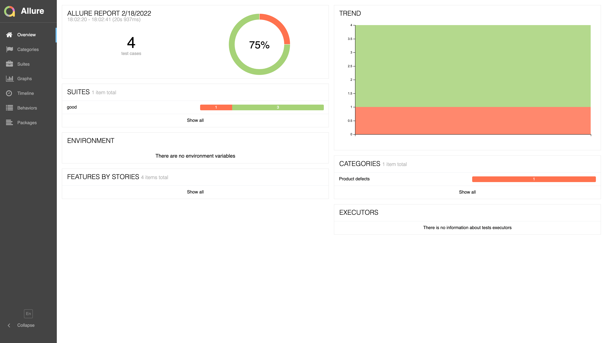

### 如何动态生成allure报告?   
`allure` 使用了 `pytest` 的 `pytest_runtest_logfinish` hook函数为每个测试用例生成报告数据.   
为了能动态生成`allure report`, 需要当测试用例执行完成后, 生成报告数据的第一时间, 执行一次生成报告的动作.  

- [程序入口: main.py](main.py)  

- [钩子位置: conftest.py](conftest.py)  

- [测试用例: example.py](example.py)  

效果图:  

